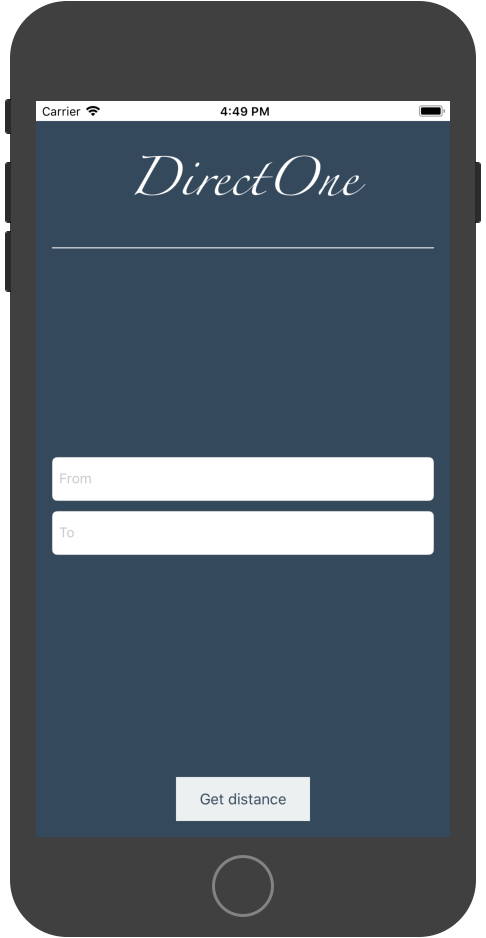
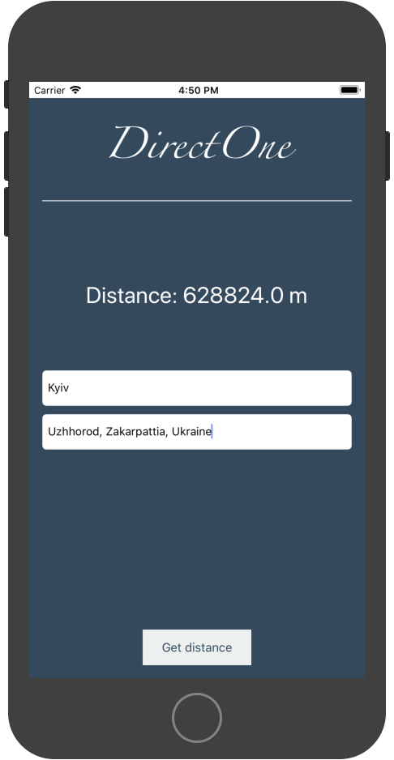

# DirectOne

App for finding distance between 2 points on map.

### TODO:

 - Repack GeographicLib for iOS and recompile for **arm**
 - Better UI
 - etc.

### BUGS:
- GeographicLib compiled for x86_64. On real iPhone GeographicLib wouldn't work (need **arm**)
- Tested on Mac OS X 10.13.5 with Xcode iOS emulator, may not work on another systems.

#### Used libraries:
* [GeographicLib](https://geographiclib.sourceforge.io/)

